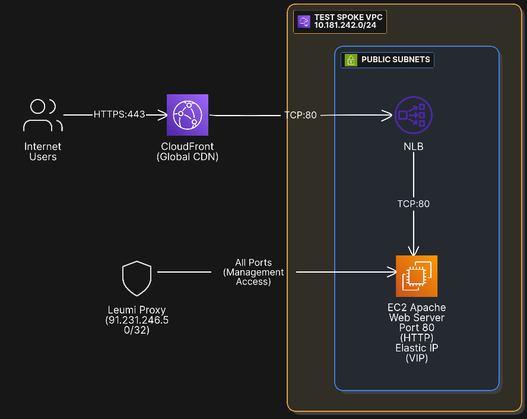

# Leumi DevOps Home Assignment

## Overview

This repository has a mono-repo structure, and contains a **3-part DevOps project** showcasing modern DevOps practices, infrastructure as code, and troubleshooting skills.

1. **Part 1: Quiz App Pipeline** – Flask web application with Jenkins CI/CD on Amazon EKS using GitOps (ArgoCD).
2. **Part 2: Secure Apache Server** – Terraform-provisioned web server with NLB and CloudFront CDN.
3. **Part 3: Technical Questions** – AWS networking and troubleshooting scenarios with detailed answers.

---

## Repository Structure

```
Leumi-project/
├── quiz-app/                    # Part 1: Flask Quiz App + EKS Infrastructure
│   ├── src/                
│   ├── iac/                    
│   │   ├── terraform/       
│   │   ├── scripts/            
│   │   └── docs/           
│   └── gitops/               
│       ├── applications/        
│       ├── bootstrap/          
│       ├── jenkins-platform/   
│       └── quiz-app/            
│
├── terraform/                   # Part 2: Apache Server Infrastructure
│   ├── ec2/                
│   ├── vpc/              
│   ├── nlb/                 
│   ├── security-groups/    
│   └── cloudfront/         
│
├── questions/                   # Part 3: Technical Questions
│   ├── questions.txt       
│   └── answers.txt   
└── docs/                        # Documentation       
```

---

## Part 1: Quiz App Pipeline – Flask on Amazon EKS

This project showcases a CI/CD Pipeline on AWS EKS, using Jenkins to run CI and ArgoCD for CD operations.
All services are accessable using HTTPS using route53 and ACM.
Infrastructure is orchestrated via Terraform and configured using Argocd App of apps pattern.

### Architecture Overview

**Full CI/CD pipeline with GitOps workflow:**

```
Developer Push → GitHub Webhook → Jenkins Pipeline → Docker Build (BuildKit) 
    → Push to Docker Hub → Update GitOps Repo → ArgoCD Sync Deployment
```

**Infrastructure Components:**
- **AWS EKS Cluster**: running Kubernetes cluster
- **Jenkins Controller**: EC2 in the private subnet, orchestrates builds
- **Jenkins Agents**: running as dynamic pod on EKS
- **ArgoCD**: GitOps CD, manages all EKS configurations, in app-of-apps pattern
- **AWS ALB**: HTTPS for ingress to all services
- **Route53**: Public domain for all resources
- **External Secrets Operator**: syncing from AWS SSM Parameter Store

### Quick Start

#### Configure values

- Edit: **[terraform.tfvars](quiz-app/iac/terraform/terraform.tfvars)** for resource provisioning
- Edit: **[config-loader.sh](quiz-app/iac/scripts/management/lib/helpers/config-loader.sh)** for scripts default values 
- Edit: **[argocd](quiz-app/gitops/)** values for application configuration

#### Prerequisites

- AWS Account with appropriate IAM permissions
- AWS CLI configured
- Public domain in route53
- Terraform >= 1.5
- kubectl >= 1.31
- Helm >= 3.12
- Docker Hub account
- GitHub repository access

- **[Project dependencies](configs/project-dependencies.txt)** – Extra dependencies for scripts

#### Deploy Infrastructure

- **To deploy and manage the project**, check out the management scripts to get started:

  **[Scripts overview](quiz-app/iac/scripts/README.md)** 

#### Understanding GitOps and terraform 

- **Check out these documents, explaining the architecture of ArgoCD I used, and the choices i took**:

  **[GitOps structure](quiz-app/gitops/README.md)** |
  **[Terraform vs Kuberenets API](docs/design-choice-alb.txt)** 

#### Access Applications

```bash
# Quiz App
https://quiz.weatherlabs.org

# ArgoCD UI
https://argocd.weatherlabs.org

# Jenkins
https://jenkins.weatherlabs.org
```

### Architecture Diagram


## Part 2: Secure Apache Server – Terraform Infrastructure

This project deploys a secure, highly available web infrastructure for hosting an Apache web server on AWS. 
Using CloudFront and NLB for public web traffic, and secure direct administrative management.

### Architecture Overview

**Infrastructure Components:**
- **TEST SPOKE VPC**: Hosting resources (`10.181.242.0/24`)
- **EC2 Instance**: Apache web server with Elastic IP
- **Security Group**: Allow access only from Leumi proxy and CloudFront
- **NLB**: Internet-facing, Load balancing (maintains source IP)
- **Target Group**: HTTP:80, health checks, Backend routing 
- **CloudFront**: Global distribution, CDN & DDoS protection 

### How to Deploy

#### Prerequisites

1. **AWS CLI** configured with credentials
2. **Terraform** >= 1.0 installed
3. **AWS Account** with appropriate permissions

#### Deployment Guide

```bash
# From project root
cd terraform/

# Initialize Terraform
terraform init

# Review resources
terraform plan

# Deploy infrastructure
terraform apply -auto-approve

# Get outputs
terraform output cloudfront_domain_name
terraform output nlb_dns_name
terraform output ec2_public_ip
```

### Architecture Diagram


## Part 3: Technical Questions – AWS Troubleshooting

### Files

- **[answers.txt](questions/answers.txt)** – Detailed troubleshooting steps and solutions
  
### Architecture Diagram For questions


