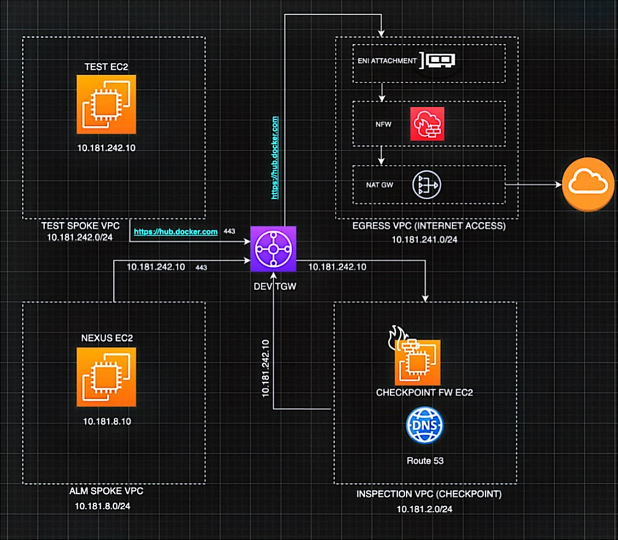

# Leumi DevOps Home Assignment

## Overview

This repository contains a **3-part DevOps project** showcasing modern DevOps practices, infrastructure as code, and troubleshooting skills.

1. **Part 1: Quiz App Pipeline** – Flask web application with Jenkins CI/CD on Amazon EKS using GitOps (ArgoCD).
2. **Part 2: Secure Apache Server** – Terraform-provisioned web server with NLB and CloudFront CDN.
3. **Part 3: Technical Questions** – AWS networking and troubleshooting scenarios with detailed answers.

---

## Repository Structure

```
Leumi-project/
├── quiz-app/                    # Part 1: Flask Quiz App + EKS Infrastructure
│   ├── src/                     # Flask application source code
│   ├── iac/                     # Infrastructure as Code (Terraform)
│   │   ├── terraform/           # AWS resources (VPC, EKS, Jenkins, IAM)
│   │   ├── scripts/             # Deployment automation scripts
│   │   └── docs/                # Architecture documentation
│   └── gitops/                  # Kubernetes manifests (ArgoCD GitOps)
│       ├── applications/        # ArgoCD Application definitions
│       ├── bootstrap/           # ArgoCD bootstrap (App of Apps)
│       ├── jenkins-platform/    # Jenkins agent platform resources
│       └── quiz-app/            # Quiz app Helm chart
│
├── terraform/                   # Part 2: Apache Server Infrastructure
│   ├── ec2/                     # EC2 instance configuration
│   ├── vpc/                     # VPC and networking
│   ├── nlb/                     # Network Load Balancer
│   ├── security-groups/         # Security group rules
│   └── cloudfront/              # CloudFront distribution
│
└── questions/                   # Part 3: Technical Questions
    ├── questions.txt            # Problem scenarios
    └── answers.md               # Detailed solutions
```

---

## Part 1: Quiz App Pipeline – Flask on Amazon EKS

### Architecture Overview

**Full CI/CD pipeline with GitOps workflow:**

```
Developer Push → GitHub → Jenkins Pipeline → Docker Build (BuildKit) 
    → Push to Docker Hub → Update GitOps Repo → ArgoCD Sync → EKS Deployment
```

**Infrastructure Components:**
- **AWS EKS Cluster** running Kubernetes cluster, 2 nodes
- **Jenkins Controller** on EC2 (t3.small) with SSM-only access (private subnet)
- **Jenkins Agents** running as dynamic pods on EKS
- **BuildKit DaemonSet** for Docker image builds (no Docker-in-Docker)
- **ArgoCD** for GitOps continuous delivery
- **AWS ALB** HTTPS (ACM certificate) for ingress
- **External Secrets Operator** syncing from AWS SSM Parameter Store

### Quick Start

#### Configure values

- Edit: **quiz-app/iac/terraform/terraform.tfvars** for resource provisioning
- Edit: **quiz-app/iac/scripts/lib/helpers/config-loader.sh** values for scripts default configuration 
- Edit: **quiz-app/gitops/** values for resource configuration

### Prerequisites

- AWS Account with appropriate IAM permissions
- AWS CLI configured (`aws configure`)
- Terraform >= 1.5
- kubectl >= 1.28
- Helm >= 3.12
- Docker Hub account
- GitHub repository access

#### Deploy Infrastructure

```bash
# Enter scripts directory
cd quiz-app/iac/scripts/management

# Run main launch script
./manage-project (apply|destroy|validate)

Commands:
  --apply,    -a     - Deploy infrastructure and Helm charts
  --destroy,  -d     - Tear down all infrastructure
  --validate, -v     - Validate Helm chart structure and configuration


# Configure kubectl
aws eks update-kubeconfig --name devops-quiz-eks --region eu-north-1
```

#### Access Applications

```bash
# Quiz App
https://quiz.weatherlabs.org

# ArgoCD UI
https://argocd.weatherlabs.org
# Username: admin
# Password: (get from project-utils.sh script)
```

### Architecture Diagram


## Part 2: Secure Apache Server – Terraform Infrastructure

### Architecture Overview

**Three-tier secure web server architecture:**
- **EC2** running Apache web server (port 80)
- **NLB** (Network Load Balancer) for high availability
- **CloudFront** CDN for global content delivery and DDoS protection

### Components

| Resource | Configuration | Purpose |
|----------|--------------|---------|
| **EC2 Instance** | Amazon Linux 2, t3.micro | Apache web server |
| **Security Group** | Ingress: 91.231.246.50:80 | Access control |
| **NLB** | Internet-facing | Load balancing |
| **Target Group** | HTTP:80, health checks | Backend routing |
| **Elastic IP** | Static VIP | Fixed IP address |
| **CloudFront** | Global distribution | CDN & DDoS protection |

### How to Deploy

```bash
cd terraform/

# Initialize Terraform
terraform init

# Review resources
terraform plan

# Deploy infrastructure
terraform apply -auto-approve

# Get outputs
terraform output cloudfront_domain_name
terraform output nlb_dns_name
terraform output ec2_public_ip
```

### Architecture Diagram


## Part 3: Technical Questions – AWS Troubleshooting

#### These questions reference the architecture in part 2

### Files

- **[questions.txt](questions/questions.txt)** – Problem scenarios and questions
- **[answers.txt](questions/answers.txt)** – Detailed troubleshooting steps and solutions